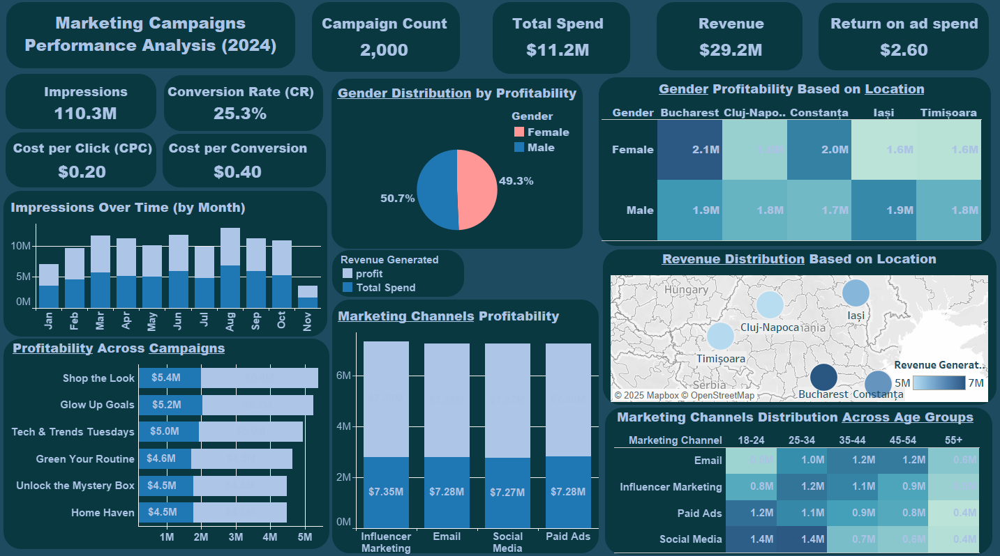

# Marketing Campaigns Performance Analysis (2024)
  

## **Table of Contents**
1. [Overview](#overview)
2. [Key Insights](#key-insights)
   - [Campaign Performance](#1-campaign-performance)
   - [Monthly Trends](#2-monthly-trends)
   - [Profitability by Campaign](#3-profitability-by-campaign)
   - [Marketing Channel Effectiveness](#4-marketing-channel-effectiveness)
   - [Gender & Location Profitability](#5-gender--location-profitability)
   - [Regional Revenue Trends](#6-regional-revenue-trends)
   - [Marketing Channel Distribution by Age](#7-marketing-channel-distribution-by-age)
3. [Strategic Recommendations](#strategic-recommendations)
4. [Conclusion](#conclusion)
5. [Thank You](#thank-you)

---

## **Overview**
The dashboard provides an in-depth analysis of marketing campaigns, covering impressions, conversions, spending, revenue, and profitability across different segments. The total **campaign count is 2,000**, with a **total spend of $11.2M** generating **$29.2M in revenue**, leading to a **return on ad spend (ROAS) of $2.60**.

---

## **Key Insights**

### **1. Campaign Performance**
- **Impressions:** 110.3M total impressions, with fluctuations across months.
- **Conversion Rate (CR):** 25.3%, indicating effective audience targeting.
- **Cost per Click (CPC):** $0.20, suggesting a relatively low acquisition cost.
- **Cost per Conversion:** $0.40, confirming cost efficiency in lead generation.

### **2. Monthly Trends**
- Impressions peak in **August** and **March**, suggesting seasonal performance variations.
- A significant **drop in November**, requiring investigation into potential campaign adjustments.

### **3. Profitability by Campaign**
- **Top-performing campaigns:**  
  - *Shop the Look* ($5.4M revenue, $3.0M spend)  
  - *Glow Up Goals* ($5.2M revenue, $3.2M spend)  
  - *Tech & Trends Tuesdays* ($5.0M revenue, $3.0M spend)
- The **least profitable campaigns** (*Home Haven* and *Unlock the Mystery Box*) require reassessment.

### **4. Marketing Channel Effectiveness**
- **Influencer Marketing:** $7.35M revenue  
- **Email Marketing:** $7.28M revenue  
- **Social Media:** $7.27M revenue  
- **Paid Ads:** $7.28M revenue  

All channels are performing similarly, but **Influencer Marketing** leads in profitability.

### **5. Gender & Location Profitability**
- **Gender-based revenue split:**  
  - **Males:** 50.7%  
  - **Females:** 49.3%  
  This suggests near-equal performance across genders.

- **Location-based performance:**  
  - Highest revenue: **Bucharest ($2.1M, female segment)**  
  - Lower revenues in **Cluj-Napoca, Iași, and Timișoara** indicate potential marketing inefficiencies.

### **6. Regional Revenue Trends**
- **Strong revenue concentration in Bucharest and Constanța.**
- **Iasi, Cluj-Napoca, and Timișoara have lower revenue generation**, indicating opportunities for localized marketing strategies.

### **7. Marketing Channel Distribution by Age**
- **18-24 age group favors Social Media.**  
- **Older age groups (45+) engage more with Email and Paid Ads.**  
- **Influencer marketing underperforms in older demographics.**  
- Suggests the need for **age-specific ad targeting strategies.**

---

## **Strategic Recommendations**

1. **Optimize Low-Performing Campaigns**  
   - Reassess and tweak campaigns like *Home Haven* and *Unlock the Mystery Box* to improve profitability.
  
2. **Leverage High-Performing Channels**  
   - Invest more in **Influencer Marketing**, which has the highest revenue.
   - Expand **Social Media efforts for younger audiences** and **Paid Ads for older demographics**.

3. **Address Regional Performance Gaps**  
   - Strengthen campaigns in **Cluj-Napoca, Iași, and Timișoara** to balance revenue distribution.
   - Implement **localized advertising strategies** to drive engagement.

4. **Stabilize Monthly Revenue Fluctuations**  
   - Investigate **November’s drop in impressions and revenue** to mitigate seasonal impact.

5. **Refine Gender-Based Targeting**  
   - Since profitability is almost equal between males and females, tailor messaging to enhance engagement for both groups.

---

## **Conclusion**
The dashboard highlights an overall **successful marketing performance**, with a **strong ROI of $2.60**. However, **regional and campaign-specific inefficiencies exist**, requiring **strategic optimization**. By **leveraging high-performing channels**, **targeting underperforming locations**, and **adjusting seasonal strategies**, the company can **further maximize profitability and engagement**.

---

## **Thank You**
Thank you for reviewing this analysis. If you have any questions or need further analysis, feel free to reach out!

